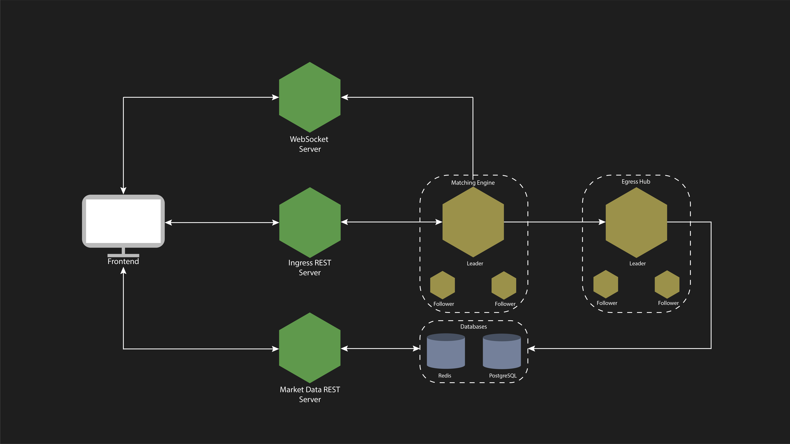
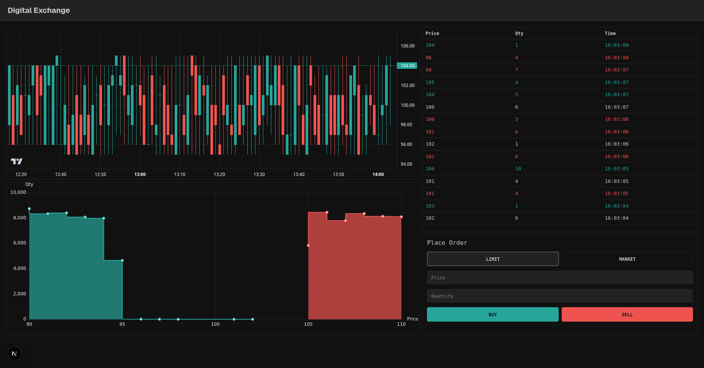

# Digital Exchange

A simple digital exchange implementation built as a learning and experimentation project.  
The system uses a **distributed, event-driven architecture**, leveraging **Aeron** for high-performance internal communication and **RAFT-based clusters** for fault tolerance and consistency.

## Capabilities

- Submit limit and market orders
- Maintain account balances
- Provide historical data for trades, candles, and order book depth
- Stream live market data via WebSocket

## Architecture Overview

The exchange is composed of multiple independent services that communicate internally using **Aeron transport**.

### Matching Engine
- **Technology:** RAFT cluster (Aeron Cluster)
- **Responsibilities:**
  - Order matching
  - Account balance management
- **Output:**
  - Persists egress events to **Aeron Archive**

### Egress Hub
- **Technology:** RAFT cluster (Aeron Cluster)
- **Responsibilities:**
  - Reads Matching Engine events
  - Distributes events to downstream databases

### Ingress REST Server
- **Technology:** Quarkus
- **Responsibilities:**
  - Provides REST APIs for submitting input data
  - Forwards requests to the Matching Engine

### Market Data REST Server
- **Technology:** Quarkus
- **Responsibilities:**
  - Provides REST APIs for querying market data
  - Exposes trades, candles, order book snapshots

### WebSocket Server
- **Technology:** Java-WebSockets
- **Responsibilities:**
  - Provides live market data feeds
  - Streams trades, candles, order book updates

### Frontend

- **Technology:** Next.js
- **Description:**
  - Simple web UI to visualize current exchange features
  - Displays live and historical market data
  - Allows order submission

### Databases
- **PostgreSQL**
  - Persistent storage for trades and candles snapshots
- **Redis**
  - In-memory storage for accounts and order book snapshots

### Communication
- **Internal protocol:** Aeron transport

## Technology Stack

- **Languages:** Java, C++
- **Backend:** Aeron Archive, Aeron Cluster
- **REST:** Quarkus
- **WebSocket:** Java-WebSockets
- **Databases:** PostgreSQL, Redis
- **Frontend:** Next.js
- **Transport:** Aeron

## Dependencies

This project builds on the following technologies and frameworks:

### Messaging & Distributed Systems
- **Aeron** – Low-latency, high-throughput messaging  
- **Aeron Cluster** – RAFT-based clustering and fault tolerance  
- **Aeron Archive** – Persistent storage and replay  
  https://github.com/aeron-io/aeron

### APIs
- **Quarkus** – Java framework for REST services  
  https://quarkus.io/
- **Java-WebSockets** – WebSocket server implementation  
  https://github.com/TooTallNate/Java-WebSocket

### Databases
- **PostgreSQL** – Relational database for trades and candles  
  https://www.postgresql.org/
  
  **Client libraries:**
  - quarkus-jdbc-postgresql (Java) https://quarkus.io/extensions/io.quarkus/quarkus-jdbc-postgresql/
  - libpqxx (C++) https://github.com/jtv/libpqxx

- **Redis** – In-memory data store for accounts and order book  
  https://quarkus.io/
  
  **Client libraries:**
  - Jedis (Java) https://github.com/redis/jedis
  - sewenew/redis-plus-plus (C++) https://github.com/sewenew/redis-plus-plus

### Frontend
- **Next.js** – React framework for frontend UI  
  https://nextjs.org/

- **Charting libraries:**
  - TradingView Lightweight Charts https://www.tradingview.com/lightweight-charts/
  - Apache ECharts https://echarts.apache.org/

## Project Status

This is a **personal project** intended for learning and experimentation with:
- Distributed systems
- Matching engines
- Event-driven architectures
- Low-latency messaging

The project is **not production-ready** and is under active development.

## Disclaimer

This project is for educational purposes only and **must not be used in production or with real funds**.
